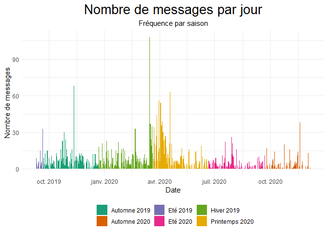
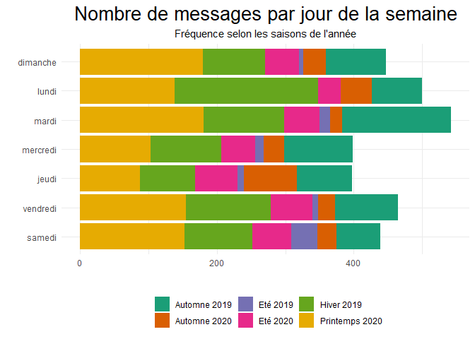
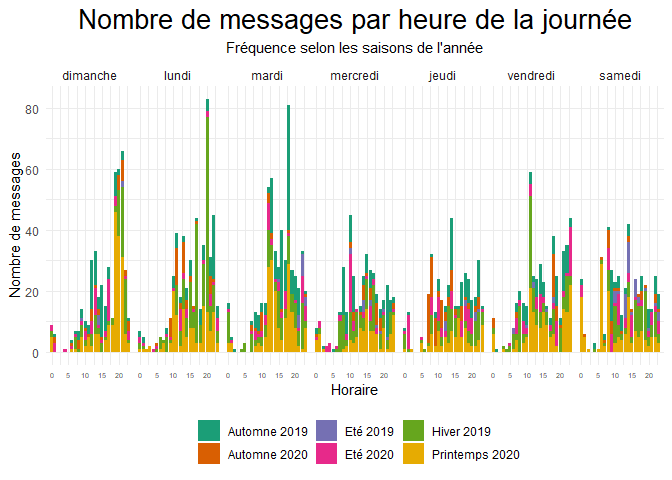
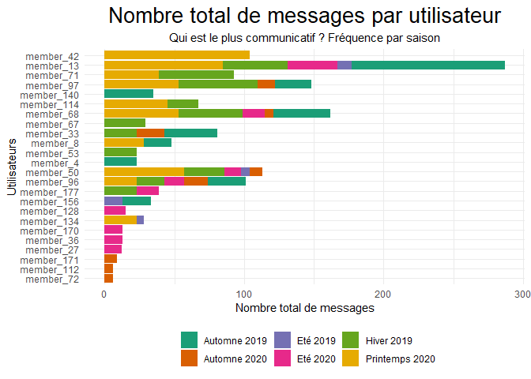
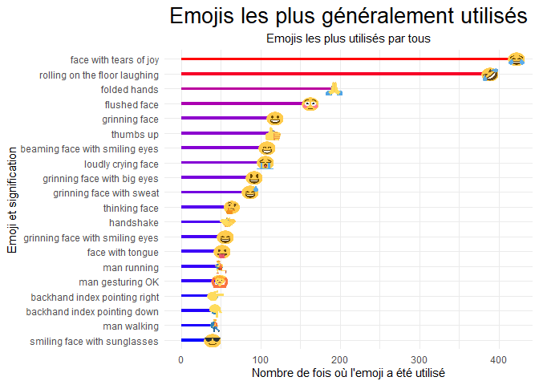
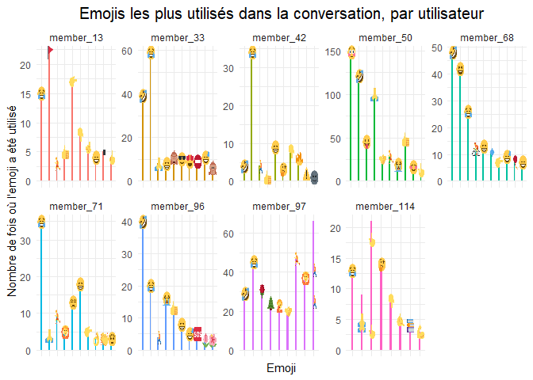
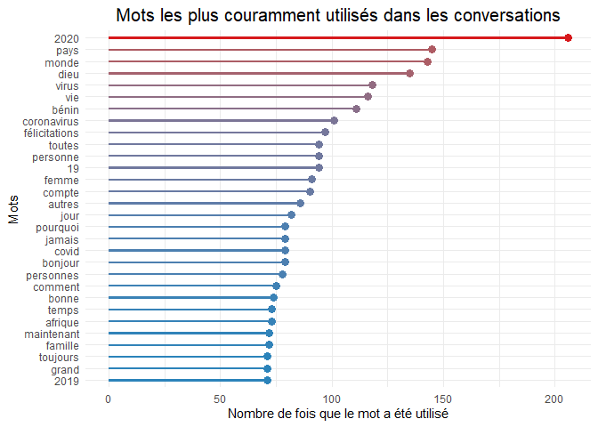
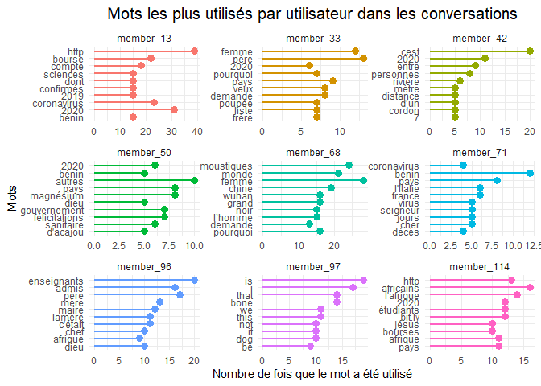

Analyse des données Whatsapp
================
Ayao Nomenyo
2020-12-24

<style>
body {
text-align: justify}
</style>

## 0.1 Introduction

`Whatsapp` est une application de messagerie instantanée et aussi un
réseau social qui nous donne la simplicité de communiquer avec nos
proches et amis, grâce à ses capacités de chat et d’échange en groupe.
Ainsi, nous générons des tas de données par nos échanges et parlant des
données, nous pensons aussi à l’analyse de ces données. Dans cet
article, il est question de montrer comment nous pouvons visualiser et
analyser nos données **Whatsapp** sous **R** avec le package
[rwhatsapp](https://cran.r-project.org/web/packages/rwhatsapp/).


Les données utilisées dans cet article proviennent des conversations
d’un groupe que nous avions créé à
l’[IMSP](http://www.imsp-benin.com/).

## 0.2 Récupération et importation des données

WhatsApp dispose d’une fonction intégrée pour l’exportation de
discussions. Il suffit d’entrer dans n’importe quel discussion que vous
désirez analyser. Les conversations de groupe sont particulièrement
intéressantes. Dans le cas où vous ne saviez pas comment exporter les
données Whatsapp, suivez les étapes suivantes:

  - Rentrez dans une discussion, appuyez sur les trois points dans le
    coin supérieur droit.
  - Sélectionnez l’option **Plus**.
  - Sélectionnez l’option **Export discussion**


``` r
chat <- rwa_read("../data/Imspdata.txt", verbose = TRUE) %>% 
  filter(!is.na(author)) %>% 
  select(-source)
```

Puisque certains membres du groupe ne sont pas dans notre répertoire, à
la place de leur nom, nous avons leur numéro de téléphone, ainsi pour
garder l’anonymat des membres du groupe, nous avons opéré un Changement
des noms pour tous les membres.

``` r
levels(chat$author) <- paste("member", 1:length(unique(chat$author)), sep = "_")
```

## 0.3 Préparation des données.

### 0.3.1 Regroupement des dates en saison.

Pour rendre l’analyse et la visualisation un peu plus intéressantes,
nous avons regroupé en saison (hiver, printemps, Été, Automne) de mars
2019 à décembre 2020.

``` r
myChat <- chat %>%
  mutate(day = date(time)) %>%
  mutate(
    saison = case_when(
      day >= dmy(22032019) & day <= dmy(21062019) ~ "Printemps 2019",
      day >= dmy(22062019) & day <= dmy(21092019) ~ "Eté 2019",
      day >= dmy(22092019) & day <= dmy(21122019) ~ "Automne 2019",
      day >= dmy(22122019) & day <= dmy(21032020) ~ "Hiver 2019",
      day >= dmy(20032020) & day <= dmy(20062020) ~ "Printemps 2020",
      day >= dmy(21062020) & day <= dmy(22092020) ~ "Eté 2020",
      day >= dmy(22092020) & day <= dmy(21122020) ~ "Automne 2020")) %>%
  mutate( saison = factor(saison)) %>%
  filter(!is.na(author))
```

## 0.4 Visualisation et analyse des données

### 0.4.1 Visualisation de la fréquence quotidienne des messages.

Notre première visualisation concerne la fréquence des messages par jour
dans le groupe sur les différentes saisons.

``` r
# Palette de couleurs
paleta.saison <- brewer.pal(7,"Dark2")

myChat %>%
  group_by(saison) %>%
  count(day) %>%
  ggplot(aes(x = day, y = n, fill=saison)) +
  geom_bar(stat = "identity") +
  scale_fill_manual(values=paleta.saison) +
  ylab("Nombre de messages") + xlab("Date") +
  labs(title = "Nombre de messages par jour",
       subtitle = "Fréquence par saison") +
  theme_minimal() +
  theme( legend.title = element_blank(),
         legend.position = "bottom",
         plot.title = element_text(hjust = 0.5, size = 20),
         plot.subtitle = element_text(hjust = 0.5))
```

<!-- -->

D’une façon générale, le groupe est toujours animé avec une faible
animation en Été et Automne 2020. On dirait qu’un évènement s’est
produit vers la fin de l’hiver 2019 et début Printemps 2020,
caractérisée par une forte conversation.

### 0.4.2 Message par jour de la semaine.

Voyons la fréquence quotidienne des messages. Nous pouvons voir les
jours de la semaines où il y a eu plus de discussion dans les saisons.

``` r
myChat %>%
  mutate( num_jsem = wday(day),
          nom_jsem = weekdays(day)) %>%
  group_by(saison, num_jsem, nom_jsem) %>%
  count() %>%
  ggplot(aes(x = reorder(nom_jsem, -num_jsem), y = n, fill = saison)) +
  geom_bar(stat = "identity") +
  scale_fill_manual(values = paleta.saison) +
  ylab("") + xlab("") +
  coord_flip() +
  labs(title = "Nombre de messages par jour de la semaine",
       subtitle = "Fréquence selon les saisons de l'année") +
  theme_minimal() +
  theme( legend.title = element_blank(),
         legend.position = "bottom",
         plot.title = element_text(hjust = 0.5, size = 20),
         plot.subtitle = element_text(hjust = 0.5))
```

<!-- --> Il
y a eu beaucoup de discussions les mardis surtout en printemps 2020 et
Automne 2019. On notera aussi les lundis qui sont caractérisés aussi par
une forte discussion principalement en Hiver 2019.

### 0.4.3 Message par heure et par jour

On peut se poser la questions de savoir quelles sont les heures
auxquelles il y a eu plus de discussions ?

``` r
jours_semaine <- c("dimanche", "lundi", "mardi", "mercredi", "jeudi", "vendredi", "samedi" )
names(jours_semaine) <- 1:7
myChat %>%
  mutate( heure = hour(time),
          num_jsem = wday(day),
          nom_jsem = weekdays(day)) %>%
  count(saison, num_jsem, nom_jsem, heure) %>%
  ggplot(aes(x = heure, y = n, fill = saison)) +
  geom_bar(stat = "identity") +
  scale_fill_manual(values = paleta.saison) +
  ylab("Nombre de messages") + xlab("Horaire") +
  labs(title = "Nombre de messages par heure de la journée",
       subtitle = "Fréquence selon les saisons de l'année") +
  facet_wrap(~num_jsem, ncol=7, labeller = labeller(num_jsem = jours_semaine)) +
  theme_minimal() +
  theme( legend.title = element_blank(),
         legend.position = "bottom",
         panel.spacing.x = unit(0.0, "lines"),
         axis.text.x = element_text(size = 5),
         plot.title = element_text(hjust = 0.5, size = 20),
         plot.subtitle = element_text(hjust = 0.5))
```

<!-- --> La
plus part des discussions ont eu lieu entre 14h à 21h les dimanches,
lundis et mardis, entre 9h et 20 les autres jours.

### 0.4.4 Qui a envoyé le plus de messages?

Voyons voir lesquels de nos utilisateurs ont montré une plus grande
intention d’échange, en fonction du nombre de messages envoyés.

``` r
myChat %>%
  mutate(day = date(time)) %>%
  group_by(saison)%>%
  count(author) %>%
  slice_max(n, prop = 0.1)  %>%
  ggplot(aes(x = reorder(author, n), y = n, fill=saison)) +
  geom_bar(stat = "identity") +
  scale_fill_manual(values=paleta.saison) +
  ylab("Nombre total de messages") + xlab("Utilisateurs") +
  coord_flip() +
  labs(title = "Nombre total de messages par utilisateur",
       subtitle = "Qui est le plus communicatif ? Fréquence par saison") +
  theme_minimal() +
  theme( legend.title = element_blank(),
         legend.position = "bottom",
         plot.title = element_text(hjust = 0.5, size = 20),
         plot.subtitle = element_text(hjust = 0.5))
```

<!-- -->

On voit clairement que l’utilisateur etiqueté *member\_13* a largement
envoyé de plus de message que les autres.

## 0.5 Quels sont les emojis les plus utilisés dans le chat?

Emojis sont des symboles graphiques Unicode, qui sont actuellement
utilisés comme abréviation pour exprimer des concepts et des idées, il
ya des centaines d’emojis et le package *rwhatsapp* nous permet
d’explorer la popularité dans les échanges de messages de toute sorte
de conversation.

``` r
plotEmojis <- myChat %>%
  unnest(c(emoji, emoji_name))  %>%
  mutate(emoji = str_sub(emoji, end = 1)) %>%
  count(emoji, emoji_name) %>%
  top_n(20, n) %>%
  arrange(desc(n)) %>%
  mutate( emoji_url = map_chr(emoji,
                              ~paste0("https://abs.twimg.com/emoji/v2/72x72/",
                                       as.hexmode(utf8ToInt(.x)),".png")))

# graphe des emojis les plus utilisés
plotEmojis %>%
  ggplot(aes(x = reorder(emoji_name, n), y = n)) +
  geom_col(aes(fill = n), show.legend = FALSE, width = .2) +
  geom_point(aes(color = n), show.legend = FALSE, size = 3) +
  geom_image(aes(image = emoji_url), size = .045) +
  scale_fill_gradient(low = "blue",high = "red") +
  scale_color_gradient(low = "#2b83ba",high = "#d7191c") +
  ylab("Nombre de fois où l'emoji a été utilisé") +
  xlab("Emoji et signification") +
  labs(title = "Emojis les plus généralement utilisés",
       subtitle = "Emojis les plus utilisés par tous") +
  coord_flip() +
  theme_minimal() +
  theme( legend.title = element_blank(),
         legend.position = "bottom",
         plot.title = element_text(hjust = 0.5, size = 20),
         plot.subtitle = element_text(hjust = 0.5)) 
```

<!-- -->

Nous avons les 20 emojis les plus utilisés dans le groupe. Aujourd’hui,
un emoji dit plus de mots. On conclura que nous avons un groupe whatsapp
géneralement en gaiété.

## 0.6 Emojis les plus utilisés dans les chats par utilisateur

Ici, nous voulons détecter les utilisateurs qui utilisent plus d’Emojis.
Afin de rendre le graphique un peu plus clair, nous avons considéré les
utilisateurs qui ont un nombre de message supérieur à la moyenne et leur
10 premiers emojis utilisés.

``` r
plotEmojis <- myChat %>%
  group_by(author) %>%
  mutate(nb = n()) %>%
  ungroup() %>%
  filter(nb >= (mean(nb))) %>%
  unnest(c(emoji, emoji_name)) %>%
  mutate( emoji = str_sub(emoji, end = 1)) %>% 
  count(author, emoji, emoji_name, sort = TRUE) %>%
  group_by(author) %>%
  top_n(n = 10, n) %>%
  slice(1:10) %>%
  mutate( emoji_url = map_chr(emoji,
                              ~paste0("https://abs.twimg.com/emoji/v2/72x72/",
                                      as.hexmode(utf8ToInt(.x)),".png")) )
plotEmojis %>%
  ggplot(aes(x = reorder(emoji, -n), y = n)) +
  geom_col(aes(fill = author, group = author), show.legend = FALSE, width = .20) +
  geom_image(aes(image = emoji_url), size=.10) +
  ylab("Nombre de fois où l'emoji a été utilisé") +
  xlab("Emoji") +
  facet_wrap(~author, ncol = 5, scales = "free") +
  ggtitle("Emojis les plus utilisés dans la conversation, par utilisateur") +
  theme_minimal() +
  theme( legend.title = element_blank(),
         legend.position = "bottom",
         axis.text.x=element_blank(),
         plot.title = element_text(hjust = 0.5, size = 15),
         plot.subtitle = element_text(hjust = 0.5))
```

<!-- -->

On a donc 9 utilisateurs qui ont un nombre de discussions supérieur à la
moyenne et ils prennent beaucoup de plaisir à écrire.

### 0.6.1 les mots les plus utilisés dans les discussions

Comme précédemment sur les Emojis, il est possible de faire une analyse
sur la fréquence des mots les plus utilisés dans le groupe Whatsapp et
par les membres du groupe. Pour rendre l’analyse plus simple, on
utilisons le pakcage
[tidytext](https://cran.r-project.org/web/packages/tidytext/vignettes/tidytext.html)
connu pour l’exploration des données textes. Avant de passer à la
classification des mots, nous avons jugé bon de retirer les mots qui
n’ont pas de signification pertinente, tels que les articles, si,
bien, etc

``` r
remover_word <- c(stopwords(language = "fr"), "a", "c'est", "cas", "1", "2",
                  "3", "4", "5", "comme","où", "car", "https", "the", "fait", 
                  "dit", "très", "quelque chose", "parce que", "je pense",
                  "était","eux", "très", "peut", "quand",  "j'ai", "comme",
                  "faire","si", "ça","déjà","omis", "plus", "quoi", "tout",
                  "donc", "va", "où","parce que", "tous", "là", "bien",
                  "oui","ni", "médias", "être","où", "merci", "qu'il", "non",
                  "and", "to", "of", "n'est", "d'un", "après", "in","aussi",
                  "avant", "avoir", "autre", "deux", "fois", "ceux","alors",
                  "encore", "rien", "nom")
myChat %>%
  unnest_tokens(input = text, output = word) %>%
  filter(!word %in% remover_word) %>%
  count(word) %>%
  top_n(30, n) %>%
  arrange(desc(n)) %>%
  ggplot(aes(x = reorder(word,n), y = n, fill = n, color = n)) +
  geom_col(show.legend = FALSE, width = 0.1) +
  geom_point(show.legend = FALSE, size = 3) +
  scale_fill_gradient(low = "#2b83ba", high = "#d7191c") +
  scale_color_gradient(low = "#2b83ba", high = "#d7191c") +
  labs(title = "Mots les plus couramment utilisés dans les conversations") +
  xlab("Mots") +
  ylab("Nombre de fois que le mot a été utilisé") +
  coord_flip() +
  theme_minimal() +
  theme( legend.title = element_blank(),
         legend.position = "bottom",
         panel.spacing.x = unit(0.0, "lines"),
         plot.title = element_text(hjust = 0.5, size = 15))
```

<!-- -->

  - L’année 2020 a été marquée par la pandémie **coronavirus**. Quoi de
    plus normal d’en parler entre étudiant. Ainsi sur notre plate-forme,
    on remarque l’utilisation des mots ou expressions comme : Covid, 19,
    2020, virus.

  - On notera aussi l’utilisation des mots comme : toutes,
    félicitations… qui se réfère forcement aux périodes des
    soutenances de mémoire.

### 0.6.2 Nombre de mots par utilisateur

Maintenant, jetons un coup d’œil sur la fréquence des mots utilisés par
quelques membres du groupe. Une fois encore pour rendre le graphique
simple, nous avons considéré que les membres qui ont un nombre
messagerie supérieur la moyenne et les dix premiers mots les plus
fréquents chez eux.

``` r
myChat %>%
  group_by(author) %>%
  mutate(nb = n()) %>%
  ungroup() %>%
  filter(nb >= (mean(nb))) %>%
  unnest_tokens(input = text,
                output = word) %>%
  filter(!word %in% remover_word) %>%
  count(author, word, sort = TRUE) %>%
  
  # Les 10 mots les plus utilisés par l'utilisateur
  group_by(author) %>%
  top_n(n = 10, n) %>%
  slice(1:10) %>%
  ungroup() %>%
  arrange(author, desc(n)) %>%
  mutate(order = row_number()) %>%
  ggplot(aes(x = reorder(word, n), y = n, fill = author, color = author)) +
  geom_col(show.legend = FALSE, width = .1) +
  geom_point(show.legend = FALSE, size = 3) +
  xlab("Mots") +
  ylab("Nombre de fois que le mot a été utilisé") +
  coord_flip() +
  facet_wrap(~author, ncol = 3, scales = "free") +
  ggtitle("Mots les plus utilisés par utilisateur dans les conversations") +
  theme_minimal() +
  theme( legend.title = element_blank(),
         legend.position = "bottom",
         panel.spacing.x = unit(0.0, "lines"),
         plot.title = element_text(hjust = 0.5, size = 15))
```

<!-- -->

## 0.7 Conclusion

Ainsi, sommes arrivé à la fin de ce tutoriel destiné à l’analyse et la
visualisation des données Whatsapp. j’espère que ça mettra au plus grand
nombre d’analyser et visualiser leur donnée obtenue depuis Whatsapp
(famille, groupe…).

Si quelque chose vous freine ou vous pose problème dans les codes,
indiquez le moi en commentaire, et j’essaierais de vous apporter une
réponse.

J’avoue que pour écrire ce tutoriel, je me suis inspéré de
l’[article](https://cosmoduende.medium.com/an%C3%A1lisis-de-chats-en-whataapp-parte-1-an%C3%A1lisis-de-texto-y-visualizaci%C3%B3n-de-datos-con-r-6d254c39029d)
de [Saúl Buentello](https://cosmoduende.medium.com/) que j’ai vraiment
apprécié.

Si cet tutoriel vous a plu ou vous a été utile, n’oubliez pas de le
partager \!.
